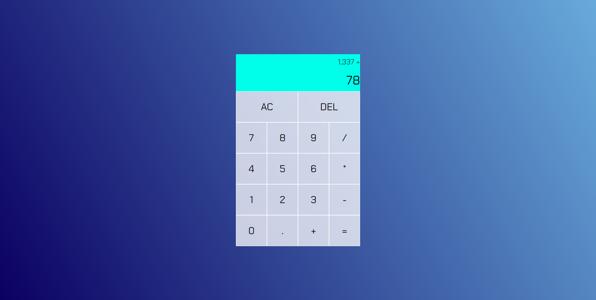

This calculator was built with HTML, CSS and JavaScript (no frameworks).

The user can add, subtract, multiply and divide numbers and display the final answer.

I've added a copy of my first attempt at programming the buttons with JavaScript called `main.js`.

My second attempt called `main2.js` uses Web Dev Simplified's video (https://www.youtube.com/watch?v=j59qQ7YWLxw&ab_channel=WebDevSimplified) as a guide. I learnt how to organise the code into a class with different functions (methods) for displaying and computing the answer by manipulating the Document Object Model (DOM).
